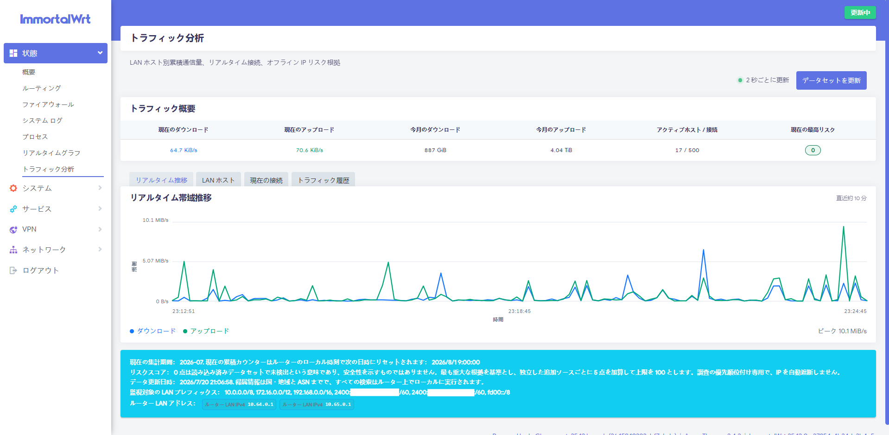
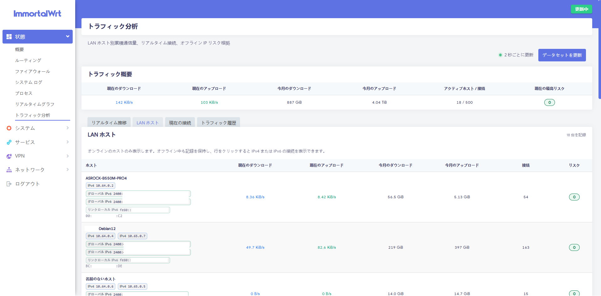
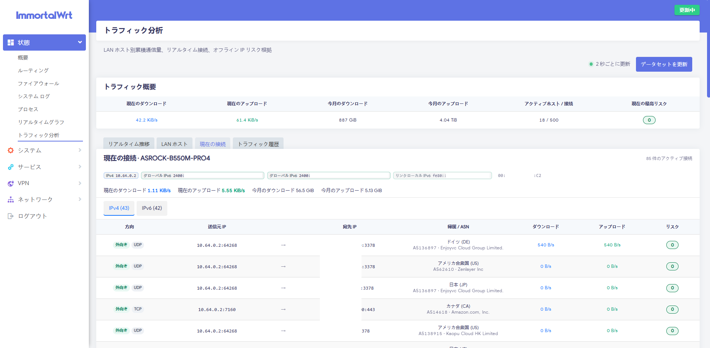
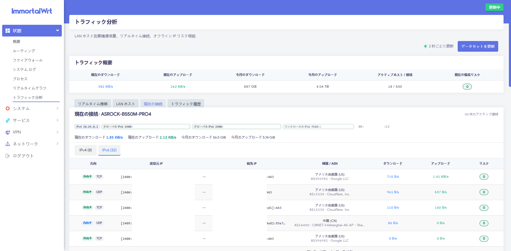
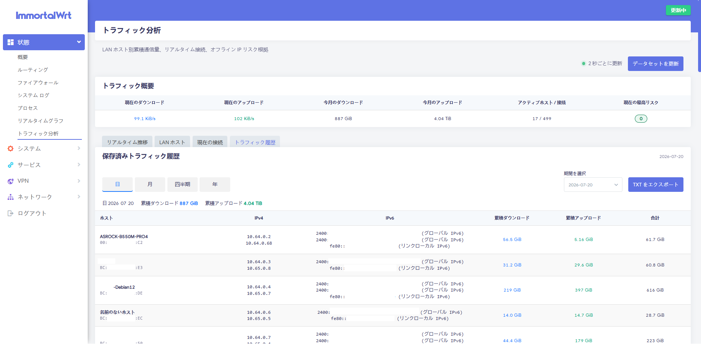

# OP Flow Insight

[简体中文](README.md) | [English](README_EN.md) | [日本語](README_JA.md)

OP Flow Insight は ImmortalWrt 25.12.0 x86_64 向けの LuCI
トラフィック可視化プラグインです。LAN 内のホストごとにアップロード／ダウンロード
通信量をルーター上で累積し、約 2 秒間隔でリアルタイム速度とアクティブ接続を表示します。
また、GitHub で公開されているデータセットをオフラインで利用し、リモート IP の
国・地域、ASN、根拠付きの 0～100 リスクスコアを表示します。

> 本プロジェクトの「OP」は OpenWrt 系プラットフォームを指します。別の
> ファームウェアへ移植する場合は Go デーモンとデータ層を維持し、
> `openwrt/rootfs` 以下のプラットフォーム統合部分を置き換えてください。

## 主な機能

- LAN IP ごとのアップロード／ダウンロード累積バイト数を永続化。
- DHCP リースと近隣テーブルの MAC により、同じ端末の IPv4／IPv6 を一つに統合。
  オンライン一覧から消えた端末も、累積値と履歴は保持。
- 接続詳細を IPv4／IPv6 の個別タブで表示し、LAN、リンクローカル、グローバル、
  ルーター自身の LAN IPv6 を識別。
- 日別記録を保持し、指定した日・月・四半期・年で集計して UTF-8 TXT へ出力。
- ルーターのローカル時刻で毎月 1 日 00:00 に現在の累積値をリセットし、
  保存済み履歴は削除しない設計。
- ホスト別・全体のリアルタイム速度、接続数、約 10 分間のトレンドグラフ。
- 各接続の方向、プロトコル、送信元 IP／ポート、宛先 IP／ポートを表示。
- IPv4、IPv6、通常の外向き通信、ポート転送（DNAT）による内向き通信に対応し、
  LAN へ委任されたグローバル IPv6 プレフィックスを自動検出。
- dnsmasq DHCP リースからホスト名と MAC アドレスを自動取得。
- ルーター自身のインターフェースアドレスを自動除外。
- リモート IP の国・地域、ASN、ネットワーク組織を完全オフラインで検索し、
  閲覧先 IP を外部検索 API へ送信しない設計。
- 複数ソースの脅威情報に基づく、説明可能な 0～100 スコア。IP を自動遮断しません。
- CGO を使用しない単一の Go バイナリ。公式 ImmortalWrt 25.12.0 SDK で
  ネイティブ APK v3 を生成。

## 画面イメージ

### プラグインのトップ画面とリアルタイム帯域推移



### デュアルスタック LAN ホストの通信量



### IPv4 の現在の接続と IP 所属情報



### IPv6 の現在の接続と IP 所属情報



### トラフィック履歴と TXT エクスポート



## 対応環境

- ImmortalWrt 25.12.0、ターゲット `x86/64`、パッケージアーキテクチャ `x86_64`。
- apk-tools 3.0.5。
- x86_64 / amd64。
- カーネル conntrack および `/proc/net/nf_conntrack`。
- LuCI、rpcd、jsonfilter、CA 証明書。

ソフトウェア／ハードウェアの Flow Offloading を有効にすると、多くの後続パケットが
通常の conntrack 集計を迂回します。累積値の精度を重視する場合は、ファイアウォール
設定で Flow Offloading を無効にしてください。本プラグインは家庭および中小規模
ネットワークの可視化・調査を目的としており、通信事業者の課金システムには適しません。

## UI 言語と言語パッケージ

`0.1.1-r6` 以降は英語をソース兼フォールバック言語とし、すべての画面文字列で
LuCI の `_()` 翻訳 API を使用します。コアパッケージは全言語を強制インストール
しません。

- `op-flow-insight` だけをインストールすると英語表示になります。英語パッケージは不要です。
- 簡体字中国語には `luci-i18n-op-flow-zh-cn` を追加します。
- 日本語には `luci-i18n-op-flow-ja` を追加します。

言語パッケージとコアパッケージのバージョンは一致させてください。`r1`～`r5` は
中国語文字列がハードコードされているため、`r6` 以降の言語パッケージでは翻訳できません。
英語または日本語 UI を使う場合はコアも最新版へ更新してください。LuCI 全体を
日本語表示にするには、通常 `luci-i18n-base-ja` という LuCI 基本日本語パッケージも
必要です。

## インストール

`op-flow-insight-<version>-r<revision>.apk` をダウンロードしてルーターへ転送します。
ローカルビルドのパッケージは OpenWrt 公式リポジトリの署名対象外なので、ローカルの
未信頼パッケージを明示的に許可してインストールします。

```sh
apk add --allow-untrusted ./op-flow-insight-0.1.1-r8.apk
/etc/init.d/op-flow enable
/etc/init.d/op-flow restart
```

LuCI で選択する言語に合わせて、任意の言語パッケージを 1 つ追加します。

```sh
# 簡体字中国語
apk add --allow-untrusted ./luci-i18n-op-flow-zh-cn-0.1.1-r8.apk

# 日本語
apk add --allow-untrusted ./luci-i18n-op-flow-ja-0.1.1-r8.apk
```

LuCI の **ステータス → Flow Insight** を開きます。初回インストール後は
**データセットを更新**をクリックするか、SSH で次を実行します。

```sh
op-flowd -config /etc/config/op-flow update-data
```

デーモンの状態とログを確認します。

```sh
op-flowd -config /etc/config/op-flow ctl health
logread -e op-flow
```

### ImmortalWrt 24.10.x IPK

ImmortalWrt 24.10.x は引き続き opkg/IPK を使用します。

```sh
opkg install ./op-flow-insight_0.1.1-r8_x86_64.ipk
# 任意：簡体字中国語または日本語を選択
opkg install ./luci-i18n-op-flow-ja_0.1.1-r8_all.ipk
# opkg install ./luci-i18n-op-flow-zh-cn_0.1.1-r8_all.ipk
/etc/init.d/op-flow enable
/etc/init.d/op-flow restart
```

## 公式 SDK による x86_64 APK のビルド

Linux、Go 1.23 以降、ImmortalWrt 25.12.0 x86/64 SDK が必要です。

```sh
bash ./scripts/build-apk.sh /opt/immortalwrt-sdk-25.12.0-x86-64
```

SDK：

```text
https://downloads.immortalwrt.org/releases/25.12.0/targets/x86/64/immortalwrt-sdk-25.12.0-x86-64_gcc-14.3.0_musl.Linux-x86_64.tar.zst
SHA-256: c228059aa1e58c3b3ae58ce8dcc7549fd08379d8e231daf80fcca15b677564cb
```

生成物は `dist/` に出力されます。GitHub Actions は同じ SDK をダウンロードして
SHA-256 を検証し、SDK 付属の `apk mkpkg` で APK v3 を生成した後、
`apk adbdump` でパッケージ名とアーキテクチャを確認します。

標準パイプラインは、対象ルーターと同じ ImmortalWrt 25.12.0 x86/64、
GCC 14.3.0、musl SDK に固定されています。本プラグインはカーネルモジュールを
含まず、デーモンも CGO に依存しないため、ルーターのカーネルモジュール ABI には
依存しません。LuCI、rpcd、jsonfilter などのランタイム依存関係はパッケージ
マネージャーが通常どおり検査します。

IPK パイプラインは ImmortalWrt 24.10.6 x86/64 公式 SDK に固定されています。

```sh
bash ./scripts/build-ipk.sh /opt/immortalwrt-sdk-24.10.6-x86-64
```

## 集計方式

デーモンは Linux conntrack の original／reply 方向のバイトカウンターを定期取得し、
リアルタイム速度を計算します。同時に ctnetlink の destroy イベントを購読して、
接続終了時の最終カウンターを取得します。これにより、2 回のポーリング間で完結した
短い接続や、最後のポーリングから接続終了までの通信量も補完します。

- LAN ホストが開始した接続：original 方向をアップロード、reply 方向をダウンロード。
- 外部から LAN へ DNAT された接続：original 方向をダウンロード、reply 方向を
  アップロード。
- LAN 間通信は標準で無視。
- ルーター自身のアドレスは自動除外。

各アクティブ接続の前回カウンターを保存するため、デーモン再起動後も継続中の接続を
二重計上しません。累積状態は標準で 5 分ごとに
`/etc/op-flow/state.json` へアトミックに書き込み、通常停止時にも保存します。

r8 以降は、端末別かつルーターのローカル暦日別の通信量も状態ファイルへ保存します。
日・月・四半期・年の表示は照会時に集計します。「今月」の累積値はルーターの
ローカル時刻で毎月 1 日 00:00 にリセットしますが、日別履歴、端末 ID、アクティブ
接続の基準値は保持します。このため月をまたぐ接続を二重計上せず、オフライン端末も
再接続時に以前の記録へ継続して集計されます。

カーネルまたは権限の制限で conntrack destroy イベントを購読できない場合は、
画面に警告を表示してポーリング方式へフォールバックします。この場合、非常に短い
接続を過少計上する可能性があります。予期しない電源断では、最後の保存以降の増分が
失われる場合があります。

## リスクスコア

スコアは接続先または接続元となるリモートのグローバル IP のみを対象とします。

1. IPsum のヒット数を 20、35、50、62、72、80、86、90 に変換。
2. カテゴリ別データソースの基準値：
   - Spamhaus DROP / EDROP：95
   - Feodo botnet/C2：90
   - Blocklist Project Malware：85
   - DShield recent attacker：70
   - Blocklist Project Abuse：65
3. 最も高い重大度を基準とし、独立した追加ソースごとに 5 点を加算（上限 100）。

区分は 0～19 低、20～39 注意、40～59 中、60～79 高、80～100 重大です。
0 点は「現在読み込まれているデータセットで観測されなかった」ことだけを意味し、
安全性が確認済みという意味ではありません。

データソース、ライセンス、利用制限は [NOTICE.md](NOTICE.md) を参照してください。

## 設定

設定ファイルは `/etc/config/op-flow` です。

| オプション | 既定値 | 説明 |
|---|---:|---|
| `lan_cidr` | RFC1918 + `fd00::/8` | 複数指定可能な LAN CIDR |
| `poll_interval` | `2s` | リアルタイム取得間隔（最小 500 ms） |
| `save_interval` | `5m` | 累積状態の保存間隔（最小 30 秒） |
| `max_flows` | `500` | Web UI へ返す最大アクティブ接続数 |
| `auto_update` | `1` | オフラインデータを自動更新 |
| `update_interval` | `24h` | データ更新間隔 |

## プライバシーとセキュリティ

- サービスは TCP ポートを待ち受けず、権限 `0600` のローカル Unix Socket のみを使用。
- Web UI は認証済み LuCI セッションと rpcd ACL 経由でのみアクセス可能。
- パケット内容、ドメイン名、URL、アカウント名、通信内容を収集しない。
- データ更新には HTTPS を使用し、応答形式とサイズを確認してからアトミックに置換。
  更新メタデータには ETag、時刻、SHA-256 を記録。

## 既知の制限

- NAT 環境では conntrack に見える端点のみ表示でき、通信事業者 CGNAT の外側の変換は
  確認できません。
- IP の位置情報はネットワーク登録・経路情報であり、端末や個人の実際の所在地では
  ありません。
- 公開脅威情報には誤検知、遅延、汚染が含まれる可能性があります。ローカルログと
  照合してください。
- CDN、クラウド、共有ホスティングでは IP が再利用されます。リスクスコアを現在の
  利用者へ直接帰属させないでください。
